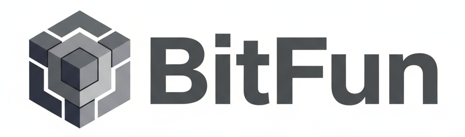
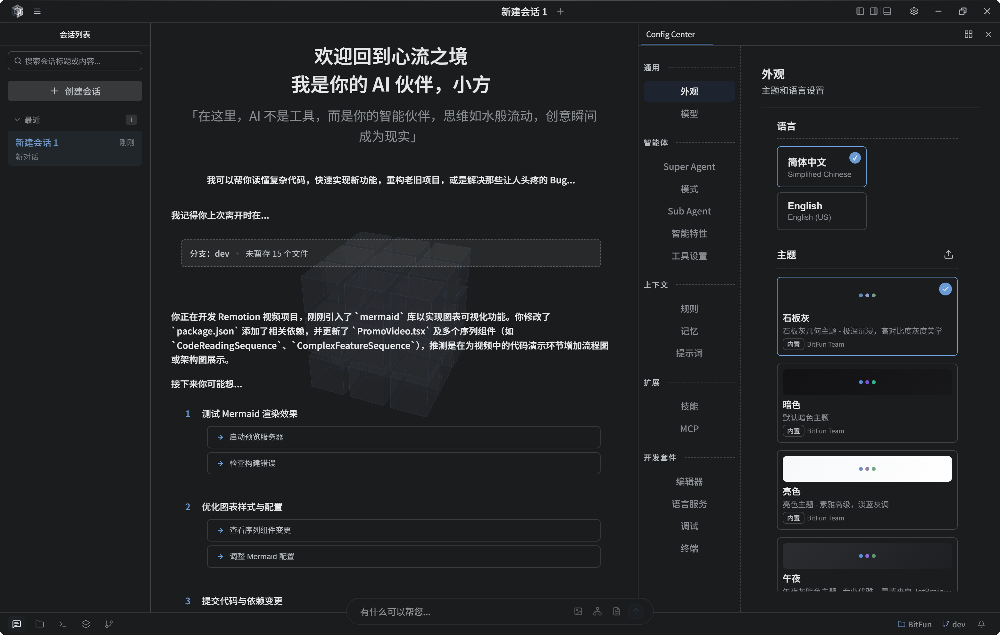

**中文** | [English](README.md)

<div align="center">



</div>
<div align="center">

[](https://github.com/GCWing/BitFun/releases)
[](https://github.com/GCWing/BitFun/blob/main/LICENSE)
[](https://github.com/GCWing/BitFun)

</div>

---

## 写在前面的话

AI时代，我们相信人机协同需要一种全新的软件形态。而当下，编程领域是这一探索最成熟的起点。

## 什么是 BitFun

BitFun 是一款代理式开发环境（ADE，Agentic Development Environment），在拥有前沿Code Agent体系的同时我们更希望深度探索并定义人机协作方式，并以Rust + TypeScript希望提供极致轻巧、流畅的体验。



### 工作模式

| 模式 | 场景 | 特点 |
|---|---|---|
| **Agentic** | 日常编码 | 对话驱动，AI 自主完成读/改/跑/验证 |
| **Plan** | 复杂任务 | 先规划后执行，关键改动点提前对齐 |
| **Debug** | 疑难问题 | 插桩取证 → 路径对比 → 根因定位 → 验证修复 |
| **Review** | 代码审查 | 基于仓库关键规范进行代码审查 |
---


### 扩展能力

- **MCP 协议**：通过 MCP 服务器扩展外部工具与资源
- **Skills**：Markdown/脚本等能力包，教 Agent 完成特定任务（自动读取Cursor、Claude Code、Codex等配置）
- **Agent 自定义**：通过 Markdown 快速自定义专业 Agent
- **Rules**：通过 Markdown 快速自定义专业 Agent（自动读取Cursor配置）

---


## 快速开始

### 直接使用

桌面端程序在 [Release](https://github.com/GCWing/BitFun/releases) 处下载最新安装包，安装后配置模型即可开始使用。

其他形态暂时仅是规范雏形未完成开发，如有需要请从源码构建。

### 从源码构建

请确保已安装以下前置依赖：

- Node.js（推荐 LTS 版本）
- pnpm（执行 `corepack enable`）
- Rust 工具链（通过 [rustup](https://rustup.rs/) 安装）
- [Tauri 前置依赖](https://v2.tauri.app/start/prerequisites/)（桌面端开发需要）

```bash
# 安装依赖
pnpm install

# 以开发模式运行桌面端
npm run desktop:dev

# 构建桌面端
npm run desktop:build
```

更多详情请参阅[贡献指南](./CONTRIBUTING_CN.md)。

## 平台支持

项目采用 Rust + TypeScript 技术栈，支持跨平台和多形态复用。
| 形态 | 支持平台 | 状态 |
|------|----------|------|
| **Desktop**（Tauri） | Windows、macOS| ✅ 已支持 |
| **CLI** | Windows、macOS、Linux | 🚧 开发中 |
| **Server** | - | 🚧 开发中 |
| **手机端** | - | 🚧 开发中 |


## 贡献
欢迎大家贡献好的创意和代码，我们对AI生成代码抱有最大的接纳程度, 请PR优先提交至dev分支，我们会定期审视后同步到主干。

我们重点关注的贡献方向：
1. 贡献好的想法/创意(功能、交互、视觉等)，提交问题
2. 优化Agent系统和效果
3. 对提升系统稳定性和完善基础能力
4. 扩展生态（SKill、MCP、LSP插件，或者对某些垂域开发场景的更好支持）


## 声明
1. 本项目为业余时间探索、研究构建下一代人机协同交互，非商用盈利项目
2. 本项目 97%+ 由 Vibe Coding 完成，代码问题也欢迎指正，可通过AI进行重构优化。
3. 项目依赖和参考了众多开源软件，感谢所有开源作者，**如侵犯您的相关权益请联系我们整改**。

---
<div align="center">
世界正在被改写，这一次，你我皆是执笔人
</div>
